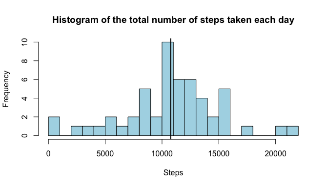
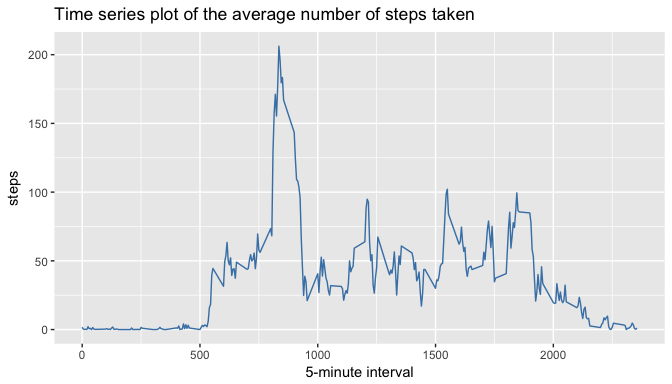
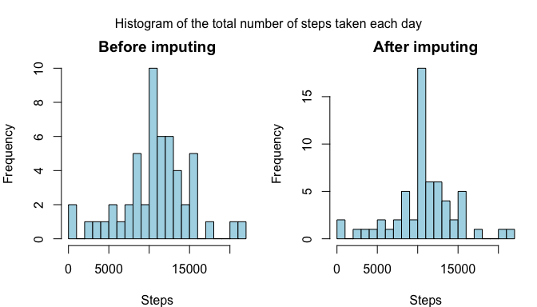
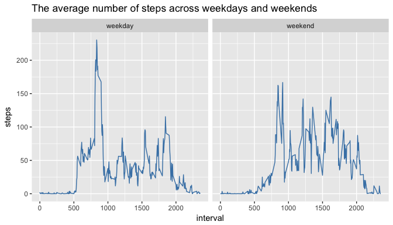

# Reproducible Research: Peer Assessment 1
## Loading and preprocessing the data
Firstly, I loaded the data and unzip it.

```r
unzip("activity.zip")
activity <- read.csv("activity.csv")
```
## What is mean total number of steps taken per day?
I made the histogram of the total number of steps taken each day by using basic plot system.

```r
steps_pday <- aggregate(steps ~ date,activity,sum)

hist(steps_pday$steps,breaks = 20,main = "Histogram of the total number of steps taken each day",xlab = "Steps",col = "light blue")
abline(v = mean(steps_pday$steps,na.rm = TRUE),lwd=2)
```

<!-- -->
Then calculate the mean and median of the total number of steps taken per day.

```r
mean_steps <- as.integer(trunc(mean(steps_pday$steps,na.rm = TRUE)))
median_steps <- as.integer(trunc(median(steps_pday$steps,na.rm = TRUE)))
```
The mean and median are equal to **10766** and **10766** respectively.

## What is the average daily activity pattern?
For exploring daily activity pattern I made a time series plot of the 5-minute interval (x-axis) and the average number of steps taken, averaged across all days (y-axis).

```r
library(ggplot2,quietly = TRUE)
ggplot(activity,aes(interval,steps))+stat_summary(fun.y = mean, geom = "line",na.rm = TRUE,col="steelblue")+ggtitle("Time series plot of the average number of steps taken")+xlab("5-minute interval")
```

<!-- -->

```r
steps_p5min <- aggregate(steps~interval,activity,mean)
max_steps_p5min <- steps_p5min$interval[which.max(steps_p5min$steps)]
```
The 5-minute interval that, on average, contains the maximum number of steps is **835**.

## Imputing missing values
The presence of missing days may introduce bias into some calculations or summaries of the data. I calculated the total number of missing values in the dataset.

```r
tot_na_r <- sum(is.na(activity)[,1]|is.na(activity)[,2]|is.na(activity)[,3])
```
The total number of rows with NA's equal to **2304**

For filling in all of the missing values in the dataset I used the mean valuaes for particular 5-minute interval.

```r
activity_noNA <- activity
for (i in 1:nrow(activity_noNA)) {
  if (is.na(activity_noNA[i,1])) {activity_noNA[i,1] <- steps_p5min$steps[which(steps_p5min$interval == activity_noNA[i,3])]}
}
```
After imputing missund values the histogram of the total number of steps taken each day looked little bit different:

```r
steps_pday2 <- aggregate(steps~date,activity_noNA,sum)
par(mfrow=c(1,2), mar=c(4,4,2,1),oma=c(0,0,2,0))
hist(steps_pday$steps,breaks = 20,main = "Before imputing",xlab = "Steps",col = "light blue")
hist(steps_pday2$steps,breaks = 20,main = "After imputing",xlab = "Steps",col = "light blue")
mtext("Histogram of the total number of steps taken each day",outer = TRUE)
```

<!-- -->

```r
mean_steps_2 <- mean(steps_pday2$steps,na.rm = TRUE)
median_steps_2 <- median(steps_pday2$steps,na.rm = TRUE)
```
## Are there differences in activity patterns between weekdays and weekends?
For exploring difference in patterns between weekdays and weekends I added a new factor variable 'day' with with two levels – “weekday” and “weekend” indicating whether a given date is a weekday or weekend day.

```r
activity_noNA$date <- as.Date(activity_noNA$date)
for (i in 1:nrow(activity_noNA)) {
  if(weekdays(activity_noNA[i,2]) %in% c("суббота","воскресенье")) 
    {activity_noNA$day[i] <- "weekend"}
  else {activity_noNA$day[i]="weekday"}
}
activity_noNA$day <- as.factor(activity_noNA$day)
```
And then made a panel plot containing a time series plot of the 5-minute interval (x-axis) and the average number of steps taken, averaged across all weekday days or weekend days (y-axis).

```r
ggplot(data=activity_noNA,aes(interval,steps))+stat_summary(fun.y = mean,geom="line",col="steelblue")+facet_grid(.~day)+ggtitle("The average number of steps across weekdays and weekends")
```

<!-- -->
Thank you!
